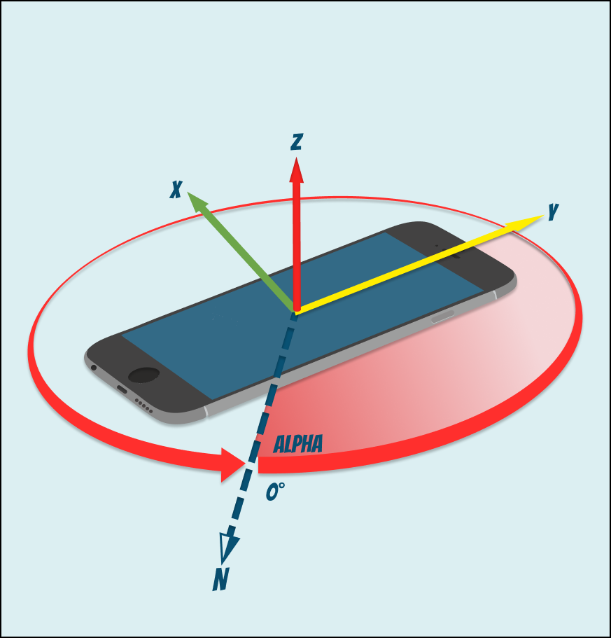

# WhatIs: Orientation detection?
Today there are many different ways to interact with smartphones: touchscreen, hardware buttons, fingerprint scanner and so on.
 But what about using orientation gestures? 
 
For example, tilting the phone up or down while pressing two touch points on an image can very accurately reflect the 
intent to zoom in or out. Alternatively, you can quickly turn your phone upside down and then back to update the
application content.  The introduction of such interaction looks promising and literally adds a new dimension to the UX.
 
Orientation gesture data can be obtained using both accelerometer and magnetometer sensors. In order to use the data from 
the orientation event of the device, it is important to understand the values provided.
       
* `alpha` - represents the movement of the device around the `Z-axis`, express in degrees with values ranging 
   from `0°` to `360°` and obtaining from the magnetometer. It equal `0°` when top of the device is pointed directly
    toward the Earth's north pole, and increases as the device is rotated toward West.
   
   

     
   
 

 * `beta` - represents the movement of the device around the `X-axis` (front to back motion), express in degrees
  with values ranging from  `-180°` to `180°`. Data obtaining from the accelerometer and equal `0°` when the device's top
   and bottom are the same distance from the Earth's surface, and increases toward `180°` as the device is tipped forward 
   and decreases toward -180° as the device is tipped backward.
   
   

     
   
 
   
 * `gamma` - represents the movement of the device around the `Y-axis` (left to right motion), express in degrees with 
 values ranging from `-90°` to `90°`. Data also obtaining from the accelerometer and equal `0°` when the device's left and 
 right sides are the same distance from the surface of the Earth, and increases toward 90° as the device is tipped toward
  the right, and toward `-90°` as the device is tipped toward the left.
   
   

     
   
 
 
 ### Reference
 * [MDN: orientation and motion data explained](https://developer.mozilla.org/en-US/docs/Web/Guide/Events/Orientation_and_motion_data_explained)
 

