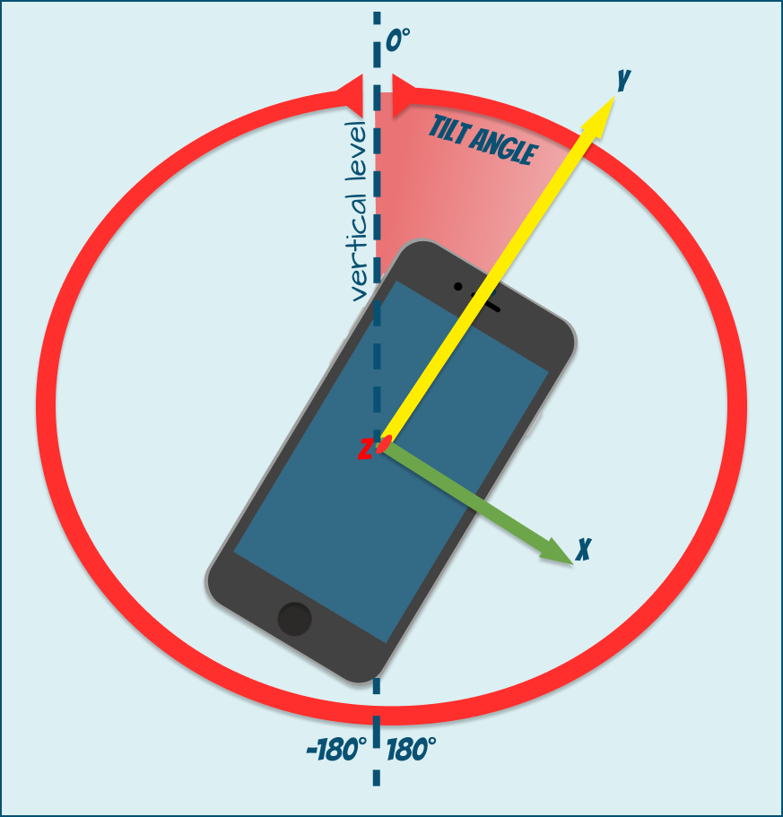

# How To: Get Landscape mode tilt

As mentioned earlier, we can get the tilt angle value (alpha, beta, gamma) relative to the three axes (X, Y, Z).
 The beta-angle is the most appropriate angle to use. It is equal to the tilt angle of the device relative to the X-axis 
 (down or up relative to itself, like a pedal in a car). But what if you want to add landscape orientation and activate 
 it only at a certain tilt angle? None of the provided angles show this angle of landscape mode. 
  
    <p align="center">
      
    </p><br>

I'm sure you'll wonder, "Hmm, how does my smartphone get the value of this angle?  How does he know for sure that the 
device is tilted enough?
To answer this question, let's go a little deeper into the school's trigonometry course. The alpha, beta, and gamma 
angles form a set of `Tate Brian's` Z-X-Y-type inner corners.
In order to get the left/right tilt angle (landscape orientation), we need to convert the available angles to the 
inner corners of [Euler](https://en.wikipedia.org/wiki/Euler_angles#Tait%E2%80%93Bryan_angles).
Using a rather useful [table on Wikipedia](https://en.wikipedia.org/wiki/Euler_angles#Rotation_matrix) we will see that

```javascript
var tilt = atan2(cos(beta)*sin(gamma), sin(beta))
```
If we put it in some JS code
```javascript
  function orientationHandler(e) {
    //convert to radians
    var betaR = e.beta / 180 * Math.PI;
    var gammaR = e.gamma / 180 * Math.PI;
    var tiltR = Math.atan2(Math.cos(betaR) * Math.sin(gammaR), Math.sin(betaR));
    // convert back to degrees
    var tiltValue = tiltR * 180 / Math.PI;
  }

  if ("ondeviceorientationabsolute" in window)
    window.addEventListener("deviceorientation", orientationHandler);
```

### Example: Roly-poly element
Let's consider an example that demonstrates how to use 'landscape mode' angle to change the rotation 
angle of the element. The element will keep the same position (relative to the conditional vertical line) 
no matter how tilted the device is.
```html
<div class="inner" id="block">
  <div class="inner" id="black"></div>
  <div class="inner" id="yellow"></div>
  <div class="inner" id="yellow"></div>
  <div class="inner" id="black"></div>
</div>

<script>
  let element = document.querySelector("#block");
  
  function levelHandler(e) {
    var betaR = e.beta / 180 * Math.PI;
    var gammaR = e.gamma / 180 * Math.PI;
    var tiltR = Math.atan2(Math.cos(betaR) * Math.sin(gammaR), Math.sin(betaR));
    var tiltValue = tiltR * 180 / Math.PI;
   element.style.transform = `rotate(${-tiltValue}deg)`;
  }
  if ("ondeviceorientationabsolute" in window)
    window.addEventListener("deviceorientationabsolute", levelHandler);
</script>
```
Try it on [codepen](https://codepen.io/Halochkin/pen/LKRpVb?editors=1000);

### Reference

*[Radian](https://en.wikipedia.org/wiki/Radian);

