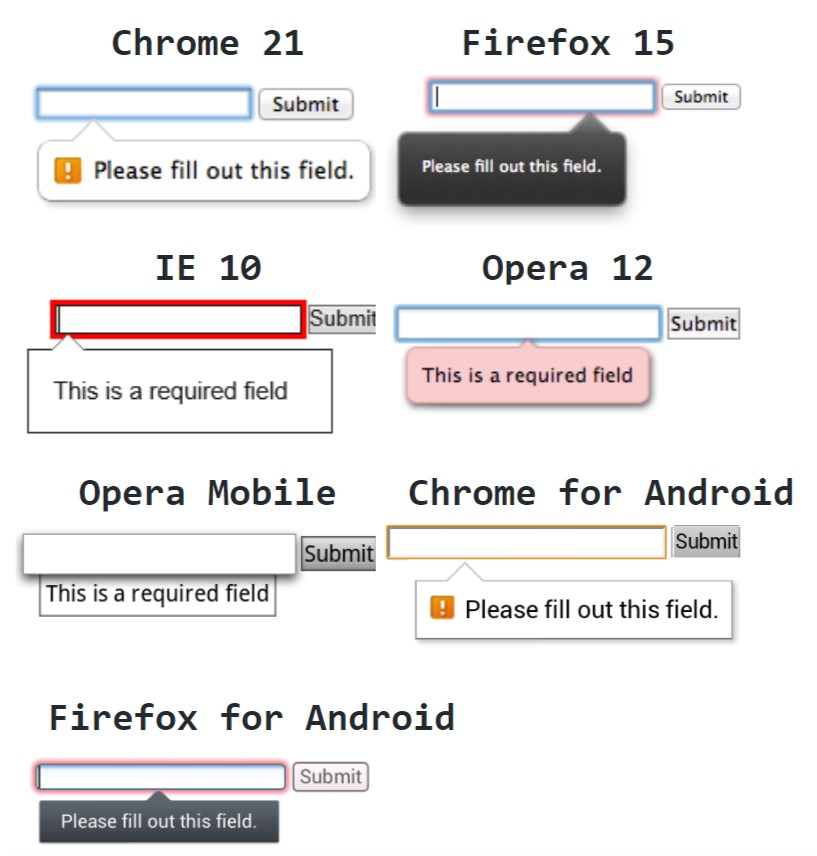

# WhatIs: Form validation

> Validation is such a serious thing that there is even a special [ISO standard](https://www.iso.org/obp/ui/#iso:std:iso:9000:ed-3:en) that denotes the definition of validation.

 `Validation` - confirmation, through the provision of objective evidence, that the requirements for a specific intended use or application have been fulfilled.

In web world validation is to find answers to the following questions:
             
 * Has the user filled in all required fields?
 * Are the data entered correct?
 * Does the entered data type match the required type?

 The purpose of form validation is:

1. To obtain correct data in the correct format for further processing. 
2. To protect the user from all kinds of data interception. 
3. Protection of the application. We do not want to be hacked through a web form and get access to the user's data that he entered earlier.

The form entry validation is something to be taken seriously. If you are lucky, there is nothing worse than garbage data that will be submitted to a site that uses data from forms without proper validation. However, there is also a chance that hackers will be able to compromise the personal data of users who have entrusted you with their information.


It is possible to implemented form validation on:

1. **Server side** - is performed by the web server _after_ receiving the entered data.
  
     When a user enters data in a form, the input data is sent to the server for verification. If the validation script on the server side detects any errors, the error status is sent to the client. The input data is sent to the next process if no error is detected.
     
2. **Client side**  - is performed by the browser _before_ sending the entered data to the server.
    
    When the user enters data in a form, the date of entry is confirmed by a script which is sent to the client along with the web page. If the script detects any error, the error status is displayed to the client. If no error is detected, the input data is sent to the server.

Here we describe client validation that is performed using a built-in HTML verification concept called _constraint validation_.

## WhatIs Constraint Validation?

Constraint validation based on:

* HTML attributes.
* CSS pseudo-selectors.
* Properties and methods of HTML DOM API.

The core of constraint validation is an algorithm browsers run when a form submitted to determine its validity. To make this determination, the algorithm utilizes new HTML attributes `min`, `max`, `step`, `pattern`, and `required` as well as existing attributes `maxlength` and `type`.

As an example, consider a form with `required` attribute and empty `value` attribute.

```html
<form>
    <input type="text" required value="" />
    <input type="submit" value="Submit" />
</form>
```

If you try to submit this form as is, browsers will prevent the submission it and show the following error:



According to the specification, the way errors are presented to the user is left to the discretion of the browser itself. However, the specification provides the full HTML DOM API, new HTML attributes and CSS pseudo-classes that developer can use to configure.
 
 Also there are no official requirements for generating a verification error message, pop-up prompts are used in all browsers for this purpose. The appearance of pop-up messages lies entirely with the developers of browsers.  So, we should be prepared to ensure that the appearance of messages will differ from browser to browser, which does not greatly contribute to the consistency of your interface.

 ### References
 * [MDN: HTML DOM API](https://developer.mozilla.org/en-US/docs/Web/API/HTML_DOM_API)
 * [WHATWG: Client-side form validation](https://html.spec.whatwg.org/multipage/forms.html#client-side-form-validation)
 * [WHATWG: Constraint validation](https://html.spec.whatwg.org/multipage/form-control-infrastructure.html#constraint-validation)
