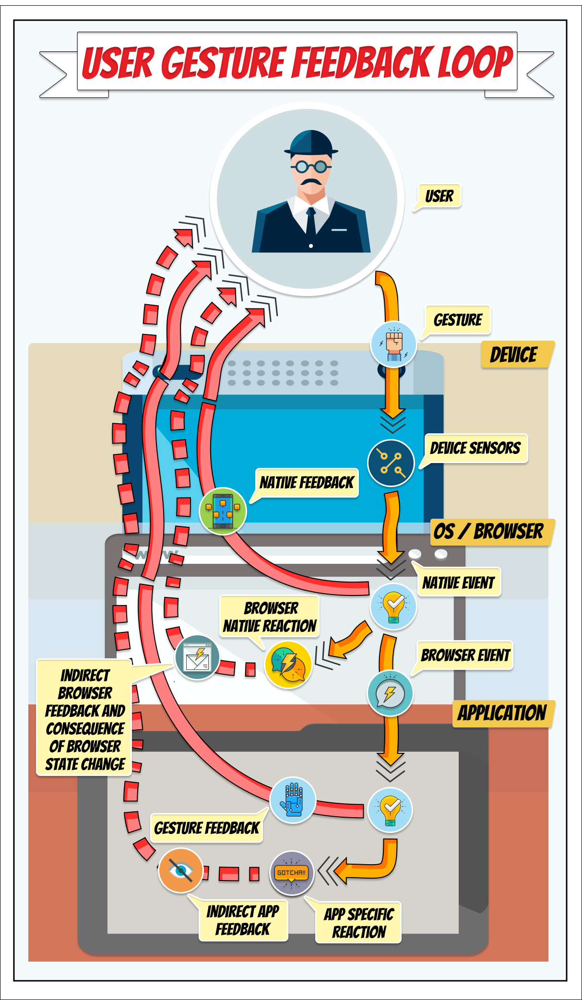

# Intro: User gesture feedback loop
 The value of any web application is determined not only by the ability to accurately and efficiently solve the task, 
but also by how easy and convenient this application can be used. 
Even the simplest, and at the same time, the functional application will be unclaimed, if the user at work with it 
quickly becomes tired, irritated, feels uncomfortable. 

In this case, the user usually makes more mistakes and works less productively. For a more comfortable and efficient
 non-contact interaction with device, the user needs additional feedback. 

*Feedback* is a reflection of the user's login action back to the user. Feedback can be a natural side-effect, such 
as tactile sensations and sounds heard when you press a finger on the keyboard. But feedback can also be obtained, 
for example, by using the type of cursor that moves around the screen. Normally (when entering text), the appearance
of the cursor is seen by the user as an invitation to enter data and indicates the position from which the characters 
typed from the keyboard will be displayed on the display screen. The shape of the cursor often indicates the current
character input mode (bottom underline - insertion mode, rectangle - overlay mode). 
> `Feedback` - the influence of the result of functioning of any system on the character of further functioning.  

There are two types of user gesture feedback loops:

* `Direct feedback`, is always done when the input event is registered.
 
  1. Direct feedback should be fine grained, immediate, unobtrusive.
  2. Direct feedback is dependable, the user will receive it regardless of the event being successful or not. This means
   that sounds should be made in all directions of movement, not just "the right one" for motion gestures.
  3. The direct feedback should be universal. The user should recognize it across apps. This also makes it possible and 
  desirable to reuse them.
  
* `Indirect feedback`, is the user perceiving the state change that occurs as a consequence of the browser or app 
changing due to a specific reaction to the input.

 1. Indirect feedback is not dependable. It likely occurs only *after* a successful interaction gesture is completed, not 
during the gesture. To rely on indirect feedback does not enable the user to correct his or her behavior or to know if 
the problem is with the execution of the gesture or the sensoring of the gesture.
 2. Indirect feedback is part of the app logic (even when that app is the browser on the os). It should not necessarily 
be esoteric, but it can be.

 

     
   
 
   
When a user interacts with a web app, it is possible to use several input devices: mouse, keyboard, touch, camera, and
device motions. Any user action from these different input devices are registered as events inside the browser, and the
browser then responds to the event appropriately. Examples of such appropriate reactions can be: 
* Hovering with the mouse over an element can cause it to change style 
* touching a link element on a touchscreen will be interpreted as a click which makes the phone navigate to a new page 
* pressing a key on the keyboard will produce a letter in the input element in focus on screen. 

The feedback reactions are also universal. Feedback are more or less the same across all apps, all browsers, and all 
applications. Sure, feedback signals can be altered: wearing gloves while typing will alter feedback; and the mouse 
pointer and scrollbar can both be hidden and changed. But in general, the feedback reactions remain universal, 
omnipresent and thus non-intrusive. The feedback main function is to enable the user to control and correct his or her
own actions. The feedback are not directly relevant, neither for the browser nor the app nor the user: it is neither
entertaining nor meaningful to watch the mouse pointer move around the screen. The feedback is only indirectly relevant
as it helps the users control their own actions.

 The feedback is "guiding signals": they are unobtrusive and do not grab the users attention. The user's perception 
of them are meant to be automated so that the user can perceive them without giving them conscious focus. The mouse 
and text cursor achieve this feat by always being the same familiar, boring, small, icons that becomes consciously 
invisible although always in the foreground. The scroll bar achieves this by staying in the edges, in our peripheral 
vision. Thus, the buttons of various dialogs in the standard window interface can be interpreted as signals to their 
pressing. But these signals are extremely weak, because all the buttons look the same, differing only in the texts in
them, and they have different functions. That is, out of all the variety of visual media - shape, size, color, 
text - in the buttons dialogs used only text.
