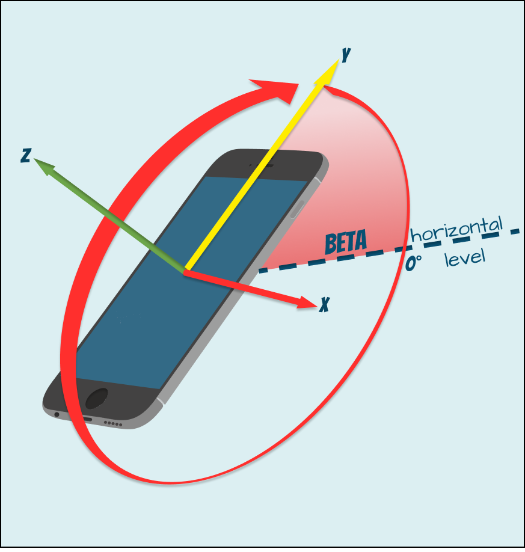

# `deviceorientationabsolute` / `deviceorientation` event
All modern smartphones are equipped with a gyroscope, which allows us to get angles of inclination of the 
device in three planes. Each minimum deviation of the phone in one of the three planes activates the 
`deviceorientationabsolute` event, which options represents the motion of the device around axis: 
 * `alpha`  - `z` axis, express in degrees with values ranging from 0 to 360.
   > The `alpha` angle is 0° when top of the device is pointed directly toward the Earth's north pole,
   > and increases as the device is rotated toward the left.
   <p></p>
 
 
 * `beta` - `x` axis, express in degrees with values ranging from -180 to 180. This represents a front to back 
    motion of the device.
   > The beta angle is 0° when the device's top and bottom are the same distance from the Earth's surface, and 
   > increases toward 180° as the device is tipped forward and decreases toward -180° as the device is tipped 
  backward.
   <p></p>
   
   
 * `gamma` - `y` axis, express in degrees with values ranging from -90 to 90. This represents a left to right motion
  of the device.
    > The gamma angle is 0° when the device's left and right sides are the same distance from the surface of the Earth,
    >and increases toward 90° as the device is tipped toward the right, and toward -90° as the device is tipped toward
    >the left.
    <p></p>
   
That means we can create our own gestures based on them! 

### Adding an Event Listener for DeviceOrientationEvent

Some older browsers may not support `deviceorientationabsolute` (which is similar to `deviceorientation`)
 and need to be supported by a simple compatibility check
 ```javascript
  if ("ondeviceorientationabsolute" in window) {                                 //[1]
     window.addEventListener("deviceorientationabsolute", (e)=> {
       console.log("I am the new nice browser");
     });
   } else if ("ondeviceorientation" in window) {                                 //[1]
     window.addEventListener("deviceorientation", function(e){
        console.log("Back in my day ... ");
     });  
   }
 ```
1. Just check for the presence of an event handler in the `window`.

### Example 1. Lumberjack
Let's look at a simple example. Imagine that your phone is an axe and you want to cut off a piece of stick.
As there is hardly a professional lumberjack among you, let's assume that the angle `gamma` axis can be from *60°*
to *90°* to simulate the axe blade. 
As for the `beta` axis, it should be less than *50°* when the axe starts swinging, and the swing angle should be more than *45°* 
(relative to the initial swing angle) before the axe cuts off the stick.

```html
<script>
(function() {
  const gammaDiapasone = [60, 90];                                                            //[2]
  const maxBeta = 50;                                                                         //[3]
  const movedAngle = 45;                                                                      //[4]
  let initialAngle = undefined;                                                               //[5]
  let backswing = false;                                                                      //[6]
               
  function lumberjack(e) {                                                                    //[1]
    if (                                                                                      //[7]
      e.gamma < -gammaDiapasone[0] &&               
      e.gamma > -gammaDiapasone[1] &&               
      e.beta < maxBeta              
    ){ 
      if (!initialAngle) initialAngle = e.beta;                                               //[8]
      
      if (!backswing && initialAngle && Math.abs(initialAngle - e.beta) > movedAngle) {       //[9]
        initialAngle = e.beta;                                                                //[10]
        backswing = true;                                                                     //[11]
        window.dispatchEvent(new CustomEvent("axe-hits", {bubbles: true, composed: true}));   //[12]                                                        //[15]
      }

      if (backswing && Math.abs(initialAngle - e.beta) > movedAngle) {                        //[13]
        initialAngle = undefined;                                                             //[14]
        backswing = false;                                                                    //[15]
        window.dispatchEvent(new CustomEvent("axe-swing", {bubbles: true, composed: true}));  //[16]
      }
    } else
    initialAngle = undefined;                                                                 //[7a]
  }

  if ("ondeviceorientationabsolute" in window) {                                              //[1]
    window.addEventListener("deviceorientationabsolute", lumberjack);
  } else if ("ondeviceorientation" in window) {
    window.addEventListener("deviceorientation", lumberjack);
  }
})();
</script>

 <div id="stick">0</div>                                                                      <!--[17]-->
 <audio>
 <sourse src="https://retired.sounddogs.com/previews/44/mp3/598597_SOUNDDOGS__ax.mp3" type="audio/mpeg"> 
</audio>
 
 
 
 <style>
  #stick{
    height: 50px;
    width 200px;
    background-color: brown;
    color: white;
    text-align: center;
    font-size: 50px
  }
 </style>
 
 <script>
  let stick = document.querySelector("#stick");                                               
  let sticksCounter = 0;                                                                      //[18]
   
  document.addEventListener("axe-hits", function(e) {                                        
    document.body.style.backgroundColor = "lightgreen";                                       //[19]
    stick.innerText = sticksCounter += 1;                                                     //[20]
  });
  
  document.addEventListener("axe-swing", function(e) {                                        
    document.body.style.backgroundColor = "yellow";                                           //[21]
  });
</script>
```
1. The event listener depends on the browser's support of the event. When the event is activated, the `lumberjack()` will
 be called.
2. Add the possible values of the `gamma` angle (vertical angle at which the axe will cut a branch).
3. Maximum permissible `beta` angle of the imaginary axle handle. (However it is an axe, not a fishing rod).
4. The `beta` angle that an axe has to be crossed before a branch can be cut.
5. Initial angle from which the angle of the axe inclination will be calculated. 
6. Alerts that the blow was made and the handle can be raised for the next swing.
7. As mentioned earlier, each movement of the device activates the `deviceorientation` event. To ensure that the device 
is still within the defined angles, add a simple check at each event call.
 * `a` - If the next event does not meet the condition, the starting angle will be undefined until the condition is met 
 again. This is done to ensure that the event is executed as an unbroken sequence of events that meet the conditions and
 follow one after the other.   Otherwise, the event can be executed in several sequences that can be interrupted and 
 restored, resulting in undesired activation of the event.
8. Once the condition is met, the initial angle from which the axe blade tilt will be counted is immediately determined.
 If the next event also meets the test conditions, the starting angle will not be overwritten.
9. The absence of `backswing` indicates that the axe is in the swing phase. The tilt angle (relative to the starting angle)
 will start to count down, provided that the initial check corresponds to all events (that the user kept the device 
 within the previously defined angles).
10. As soon as the angle of inclination is more than 45°, the initial angle will be overwritten by the actual value of 
`beta` at the time the condition is met. And in the subsequent countdown will be made concerning new value.
11.`backswing = true` indicates that the axe has cut a stick, and the it can start returns to the start position to repeat the hit.
12. Define a new custom event `axe-hits`.
13. Now there is a similar calculation of the reverse angle.
14. After the axe has been returned to the initial position, the value of the `initialAngle` will be `undefined`.
 To define the new `initialAngle` value when ` lumberjack()` is activated next time.
15. Since the axe is back in the swing phase, `backswing = false`.
16. New custom event 'axe-hits' is defined. A new custom `axe-hits` event is detected, which indicates that the axe is
 ready for the next strike and can be tilted down again.
17. Let's define a simple html element.
18. Let's add a variable that will count the number of hits of an imaginary axe against a stick.
19. When the 'axe-swing' event is activated, the background will be changed to lightgreen color, indicating that the hit 
has occurred. And the axe can be returned to the starting position.
20. Each blow will increase the number of chopped sticks by 1.
21. When the initial position of the axe is restored, the 'axe-swing' event will be activated. The background will 
turn yellow, which means that the stick is waiting for the next strike.


Try it on [codepen.io](https://s.codepen.io/Halochkin/debug/RmgbXj/xnMabNPXVgKr);
### References
1. [MDN: Orientation and motion data explained](https://developer.mozilla.org/en-US/docs/Web/Guide/Events/Orientation_and_motion_data_explained)
2. [MDN: DeviceOrientationEvent](https://developer.mozilla.org/en-US/docs/Web/API/DeviceOrientationEvent/DeviceOrientationEvent)
